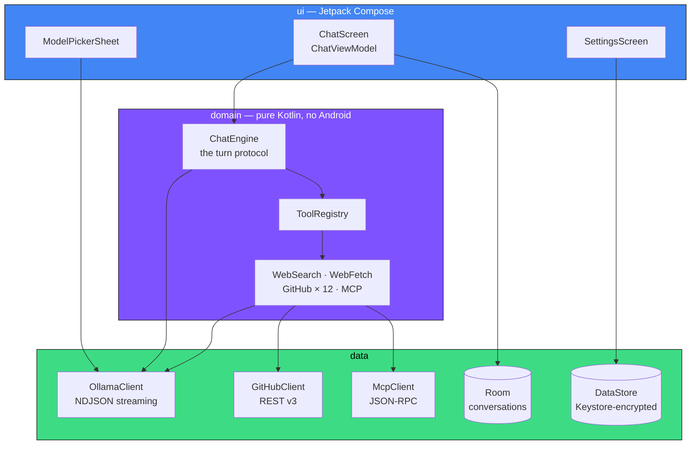
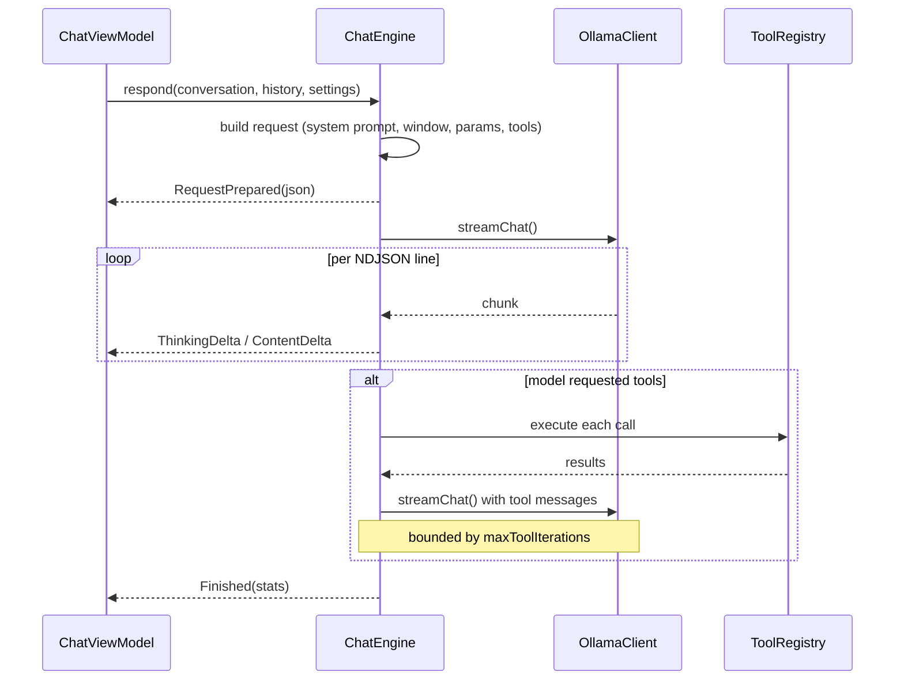

<div align="center">

# ☁️ Cirrus

**A native Android client for [Ollama](https://ollama.com) that treats your phone like a real workstation.**

Streams tokens as they arrive. Knows what each model can actually do. Reads your code on GitHub.
Speaks fluent Markdown. Never sends your keys anywhere.

[](https://github.com/klaibercore/cirrus/actions/workflows/ci.yml)
[](LICENSE)
[](https://kotlinlang.org)
[](https://developer.android.com/jetpack/compose)
[](https://developer.android.com)

</div>

---

## Why another Ollama client

Most mobile clients are a text box wrapped around `/api/chat`. Cirrus assumes you already know
what a context window is, and gets out of your way:

- The **model picker knows what each model can do** — vision, reasoning, tools, context length —
  because it asks `/api/show` rather than guessing from the name.
- **Every setting explains itself.** Long-press any control, or tap the `?`. No more wondering
  whether `min_p` and `top_k` should both be on. (They shouldn't.)
- **Tools that matter.** Web search, page fetch, and a full GitHub integration that reads your
  private repositories, triages issues and reviews pull requests.
- **Attach an MCP server** and its tools appear alongside the built-in ones.
- **Your secrets stay on the device**, encrypted with a key that never leaves the Android Keystore.

---

## Features

| | |
|---|---|
| 🧠 **Capability-aware model picker** | Cards showing parameter count, quantization, on-disk size and context window, with labelled capability chips. Filter by vision, reasoning, tools, cloud or local. |
| ⚡ **True token streaming** | NDJSON straight from `/api/chat`. Hit stop and the OkHttp call is cancelled, so the server stops generating too — no phantom token burn. |
| 🤔 **Reasoning traces** | `thinking` deltas stream into a collapsible section, with effort control for models that support it. |
| 🔧 **Tool calling** | Bounded multi-round tool loops. Web search, page fetch, GitHub, and any MCP server you attach. |
| 🐙 **GitHub integration** | Read code in public *and* private repos, search, browse trees, read issues and PR diffs. Opening issues, commenting, posting reviews and committing files are behind a separate, default-off switch. |
| 🔌 **MCP client** | Streamable-HTTP Model Context Protocol client. Point it at a remote server and its tools are discovered at runtime. |
| 🎙️ **Voice dictation** | Speak into the composer with a live level meter. Prefers Android's on-device recogniser, so audio need never leave the phone. |
| ✍️ **Markdown that survives streaming** | A hand-written CommonMark subset tolerant of half-finished input, with a real lexer for syntax highlighting — not regex passes that mistake `//` inside a string for a comment. |
| 🏷️ **Self-maintaining titles** | Threads are named from their content and re-summarised as they grow, throttled so a long session costs a handful of short requests. Rename one yourself and it is never overwritten. |
| 🌿 **Branch any conversation** | Fork from any message, edit-and-resend, regenerate, export to Markdown. |
| 🎛️ **Full sampling control** | Temperature, top-p, top-k, min-p, penalties, seed, `num_ctx`, `num_predict`, stop sequences, JSON schema output, `keep_alive` — each independently overridable, each explained. |
| 🎨 **Material 3 + dynamic colour** | Follows your wallpaper on Android 12+. Light, dark, or system. |
| 🔒 **No telemetry, ever** | No analytics, no crash reporter, no third-party backend. Two network destinations, both yours. |

---

## Quick start

```bash
git clone https://github.com/klaibercore/cirrus.git
cd cirrus
./gradlew :app:installDebug
```

Then point it at a host:

**Using your own hardware** — no key needed:

```bash
OLLAMA_HOST=0.0.0.0 ollama serve      # so your phone can reach it
```

Set the host in Settings to `http://<your-machine-ip>:11434`. From the Android emulator, use
`http://10.0.2.2:11434`.

**Using Ollama's hosted API** — create a key at
[ollama.com/settings/keys](https://ollama.com/settings/keys) and paste it into Settings → Connection.

---

## GitHub integration

Give Cirrus a token and the model can navigate your codebase mid-answer.

1. Create a token at [github.com/settings/tokens](https://github.com/settings/tokens).
   - **Classic**: the `repo` scope covers private repositories.
   - **Fine-grained**: read access to *Contents*, *Issues* and *Pull requests*; add write only for
     what you want the model to be able to change.
2. Settings → GitHub → paste the token, then turn on **GitHub tools**.
3. Leave **Allow write actions** off until you trust it.

| Tool | Reads | Writes |
|---|:---:|:---:|
| `github_list_repos` | ✅ | |
| `github_search_code` | ✅ | |
| `github_read_file` | ✅ | |
| `github_list_directory` | ✅ | |
| `github_list_issues` | ✅ | |
| `github_get_issue` | ✅ | |
| `github_list_pull_requests` | ✅ | |
| `github_get_pull_request` | ✅ | |
| `github_create_issue` | | ⚠️ |
| `github_comment` | | ⚠️ |
| `github_review_pull_request` | | ⚠️ |
| `github_create_or_update_file` | | ⚠️ |

> **The write gate is enforced at the HTTP client, not in the tool.** With writes disabled, the
> write tools are not even offered to the model, so it cannot try and fail — and a new mutating
> endpoint added later cannot forget the check.

Ask things like:

> *Read `ChatEngine.kt` in klaibercore/cirrus and explain how the tool loop terminates.*
>
> *What's still open on my repo tagged `bug`?*
>
> *Review PR #12 — focus on error handling, don't approve it.*

### Attaching an MCP server

Cirrus speaks the [Model Context Protocol](https://modelcontextprotocol.io) over streamable HTTP.
Attach a remote server with a URL and a bearer token, and its tools are discovered via `tools/list`
and bridged into the same registry the built-in tools live in.

---

## Architecture

Layered, with Hilt wiring it together. Dependencies point strictly inward.



### One assistant turn



`ChatEngine` is deliberately free of persistence and UI concerns, so the whole turn protocol is
tested against a mock server rather than a device.

---

## Releases

Every `vX.Y.Z` tag builds a signed APK and publishes it to the
[Releases page](https://github.com/klaibercore/cirrus/releases) with a `.sha256` beside it.

[Obtainium](https://github.com/ImranR98/Obtainium) tracks those releases directly — add
`https://github.com/klaibercore/cirrus` as an app and it updates itself from then on. Or download
the APK and install it by hand.

Verify what you downloaded:

```bash
sha256sum -c cirrus-1.0.0-release.apk.sha256
apksigner verify --print-certs cirrus-1.0.0-release.apk
```

The certificate fingerprint is identical across every release. If it ever changes, the build did
not come from here. [docs/RELEASING.md](docs/RELEASING.md) covers cutting one.

---

## Building

```bash
./gradlew :app:assembleDebug          # debug APK
./gradlew :app:testDebugUnitTest      # JVM unit tests
./gradlew :app:lintDebug              # Android lint
./gradlew :app:installDebug           # onto a connected device
```

Requires **JDK 17** and the Android SDK for **API 37**. `compileSdk`/`targetSdk` 37, `minSdk` 29.

AGP 9 ships built-in Kotlin support; the root `buildscript` raises KGP to 2.3.21. Compose, KSP and
the serialization plugin must all track that same release — see `gradle/libs.versions.toml`.

---

## Privacy

Cirrus talks to exactly two kinds of endpoint, both of which you choose:

1. **The Ollama host you configure** — your own machine, or `ollama.com`.
2. **`api.github.com`** — only if you enable the GitHub tools.

Plus any MCP server you explicitly attach.

Your API key and GitHub token are stored in DataStore, encrypted with AES-GCM using a key
generated in and never released from the Android Keystore. Conversations, messages and attachments
live in an app-private Room database and are never uploaded. `INTERNET` is the only permission
declared up front; `RECORD_AUDIO` is requested the first time you tap the microphone.

There is no analytics SDK, no crash reporter, and no telemetry of any kind. See
[SECURITY.md](SECURITY.md) for the full threat model.

---

## Contributing

Pull requests are welcome — please read [CONTRIBUTING.md](CONTRIBUTING.md) first. It covers the
layering rules, the comment style, and why `GenerationParams` fields are nullable on purpose.

Participation is governed by the [Contributor Covenant](CODE_OF_CONDUCT.md).

---

## Licence

[Apache License 2.0](LICENSE) © 2026 Kevin Paul Klaiber.

Cirrus is an independent project and is not affiliated with or endorsed by Ollama or GitHub.

<div align="center">
<sub>Built with Kotlin, Jetpack Compose and a lot of opinions about context windows.</sub>
</div>
