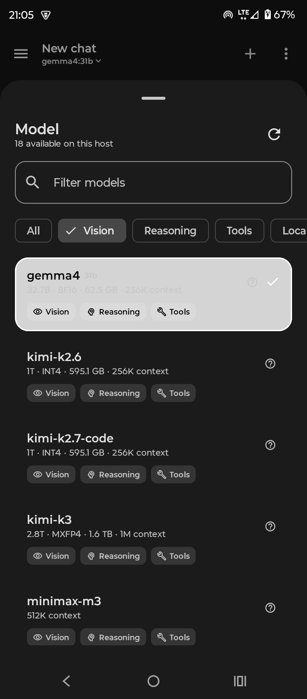
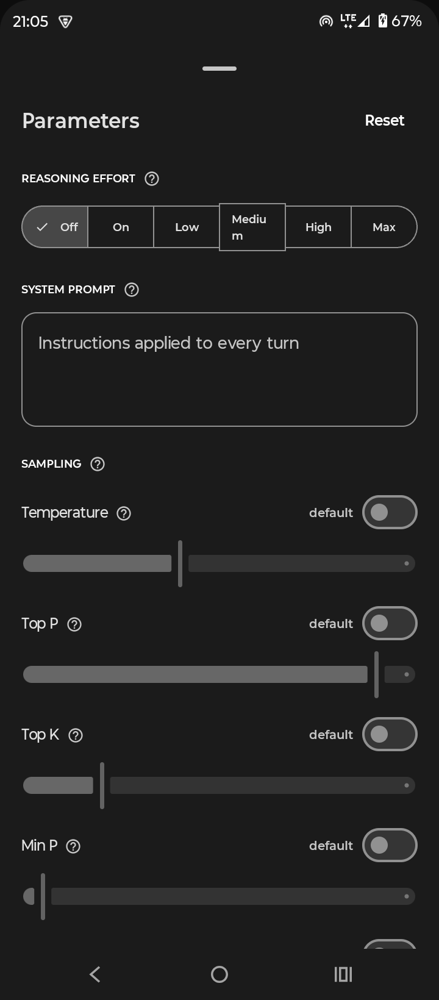
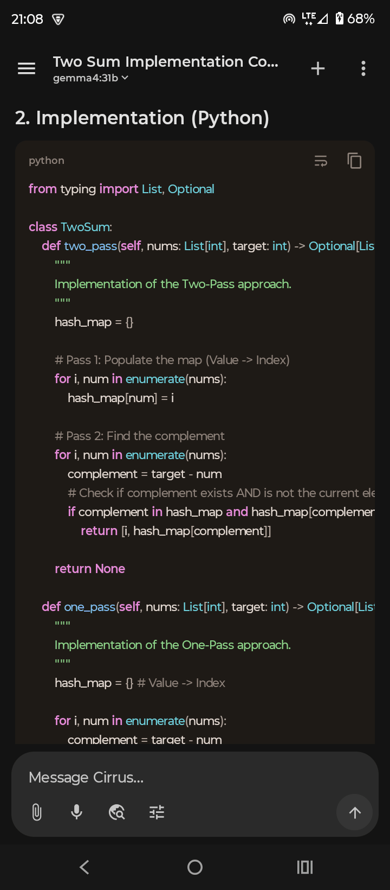
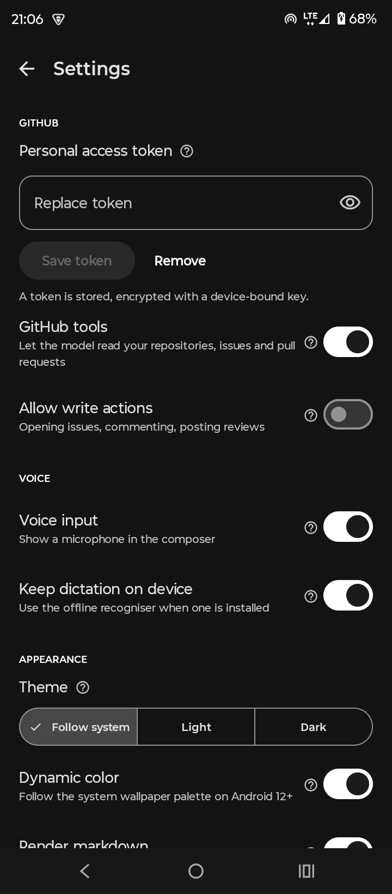
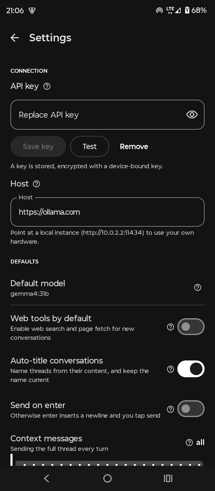
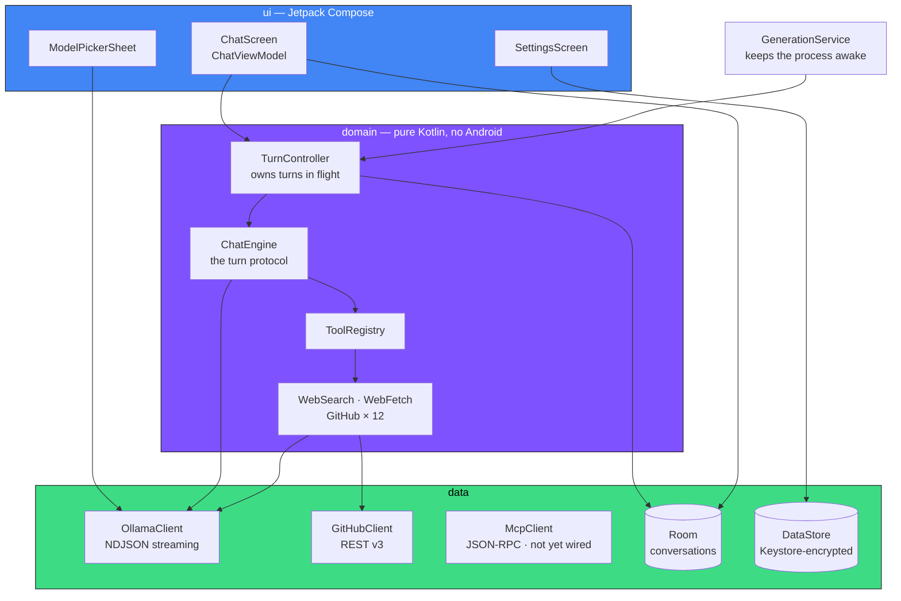
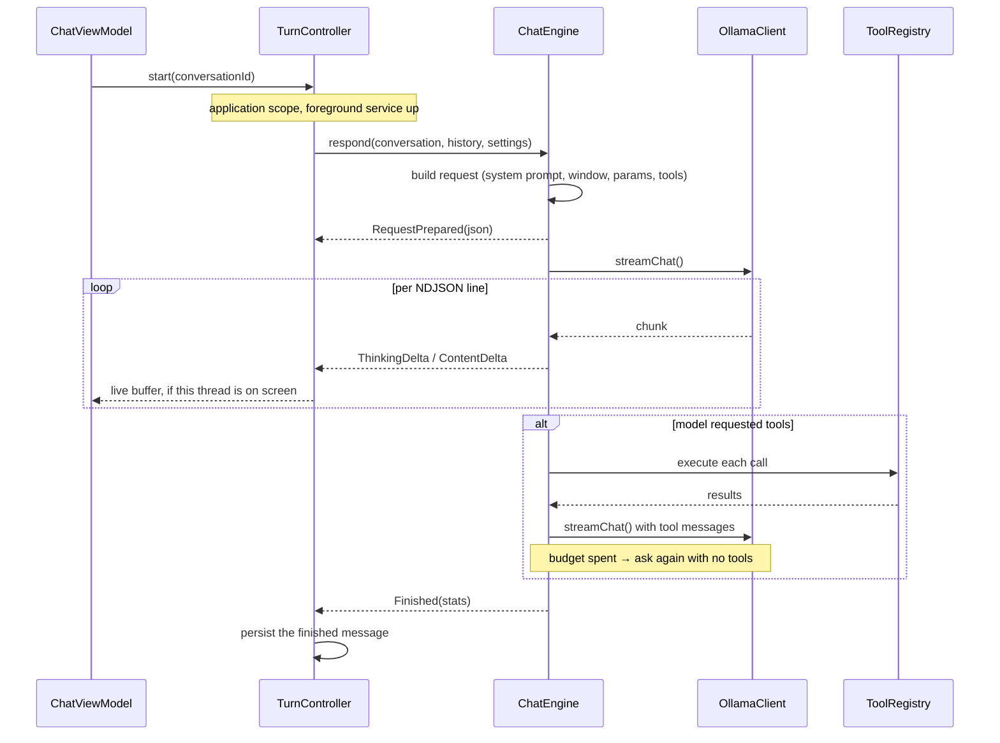

<div align="center">

# ☁️ Cirrus

**An Android [Ollama](https://ollama.com) client for developers who want their local models to
actually do things.**

[](https://github.com/klaibercore/cirrus/actions/workflows/ci.yml)
[](LICENSE)
[](https://kotlinlang.org)
[](https://developer.android.com/jetpack/compose)
[](https://developer.android.com)

</div>

---

## Install

<!-- The F-Droid link stays dead until the fdroiddata merge request is accepted. -->
[](https://f-droid.org/packages/dev.klaiber.cirrus/)
&nbsp;
[](https://github.com/klaibercore/cirrus/releases)

- **[Obtainium](https://github.com/ImranR98/Obtainium)** — add
  `https://github.com/klaibercore/cirrus` and it tracks each release automatically. The
  recommended path.
- **[GitHub Releases](https://github.com/klaibercore/cirrus/releases)** — signed APK with a
  `.sha256` beside it.
- **F-Droid** — recipe written, *not yet submitted*: it needs a `v1.0.0` tag to build from. See
  [Releasing](#releasing).

Or build it yourself — see [Building](#building).

---

## Screenshots

| | | |
|:---:|:---:|:---:|
|  |  |  |
| **Filter to the models that can actually do the job** — chips come from `/api/show`, not the name | **Every knob explained, and off unless you turn it on** — the server's own default is used otherwise | **Markdown that survives streaming**, with a real lexer for code |
|  |  | |
| **Let the model read your repositories** — writes are a separate switch, off by default | **Your key never leaves the device**, encrypted with an Android Keystore key | |

---

## Why Cirrus?

- Asks `/api/show` what each model can do, instead of guessing from names.
- Reads and writes your GitHub — writes stay off until you allow them.
- API keys encrypted with an Android Keystore key that never leaves.

At more length: most mobile clients are a text box wrapped around `/api/chat`. Cirrus assumes you
already know what a context window is, and gets out of your way.

- The **model picker knows what each model can do** — vision, reasoning, tools, context length —
  because it asks `/api/show` rather than guessing from the name.
- **Every setting explains itself.** Long-press any control, or tap the `?`. No more wondering
  whether `min_p` and `top_k` should both be on. (They shouldn't.)
- **Tools that matter.** Web search, page fetch, and a full GitHub integration that reads your
  private repositories, triages issues, reviews pull requests and commits files.
- **Your secrets stay on the device**, encrypted with a key that never leaves the Android Keystore.

---

## Features

| | |
|---|---|
| 🧠 **Capability-aware model picker** | Cards showing parameter count, quantization, on-disk size and context window, with labelled capability chips. Filter by vision, reasoning, tools, cloud or local. |
| ⚡ **True token streaming** | NDJSON straight from `/api/chat`. Hit stop and the OkHttp call is cancelled, so the server stops generating too — no phantom token burn. |
| 📵 **Answers finish without you** | Lock the phone or switch app mid-answer and the reply keeps streaming, in a foreground service you can stop from the notification. Switch threads and the one you left carries on. |
| 🤔 **Reasoning traces** | `thinking` deltas stream into a collapsible section, with effort control for models that support it. |
| 🔧 **Tool calling** | Bounded multi-round tool loops. Web search, page fetch and the GitHub tools. Spend the round budget and the model is asked once more without tools, so a turn ends on an answer rather than on a call nobody ran. |
| 🐙 **GitHub integration** | Read code in public *and* private repos, search, browse trees, read issues and PR diffs. Opening issues, commenting, posting reviews and committing files are behind a separate, default-off switch. |
| 🔌 **MCP servers** | Attach a Model Context Protocol server and its tools join the model's toolbox. Both HTTP transports (streamable and SSE), auto-detected. Adding one connects first and shows you exactly which tools you would be handing over — a server Cirrus cannot reach is a server it will not save. |
| 🎙️ **Voice dictation** | Speak into the composer with a live level meter. Prefers Android's on-device recogniser, so audio need never leave the phone. |
| ✍️ **Markdown that survives streaming** | A hand-written CommonMark subset tolerant of half-finished input, with a real lexer for syntax highlighting — not regex passes that mistake `//` inside a string for a comment. LaTeX maths is mapped to Unicode, so `$O(n \log n)$` reads as maths rather than as source. |
| 🏷️ **Self-maintaining titles** | Threads are named from their content and re-summarised as they grow, throttled so a long session costs a handful of short requests. Rename one yourself and it is never overwritten. |
| 🌿 **Branch any conversation** | Fork from any message, edit-and-resend, regenerate, export to Markdown. |
| 🎛️ **Full sampling control** | Temperature, top-p, top-k, min-p, penalties, seed, `num_ctx`, `num_predict`, stop sequences, JSON schema output, `keep_alive` — each independently overridable, each explained. |
| 🎨 **Material 3 + dynamic colour** | Follows your wallpaper on Android 12+. Light, dark, or system. |
| 🔒 **No telemetry, ever** | No analytics, no crash reporter, no third-party backend. Two network destinations, both yours. |

---

## Quick start

```bash
git clone https://github.com/klaibercore/cirrus.git
cd cirrus
./gradlew :app:installDebug
```

Then point it at a host:

**Using your own hardware** — no key needed:

```bash
OLLAMA_HOST=0.0.0.0 ollama serve      # so your phone can reach it
```

Set the host in Settings to `http://<your-machine-ip>:11434`. From the Android emulator, use
`http://10.0.2.2:11434`.

**Using Ollama's hosted API** — create a key at
[ollama.com/settings/keys](https://ollama.com/settings/keys) and paste it into Settings → Connection.

---

## GitHub integration

Give Cirrus a token and the model can navigate your codebase mid-answer.

1. Create a token at [github.com/settings/tokens](https://github.com/settings/tokens).
   - **Classic**: the `repo` scope covers private repositories.
   - **Fine-grained**: read access to *Contents*, *Issues* and *Pull requests*; add write only for
     what you want the model to be able to change.
2. Settings → GitHub → paste the token, then turn on **GitHub tools**.
3. Leave **Allow write actions** off until you trust it.

| Tool | Reads | Writes |
|---|:---:|:---:|
| `github_list_repos` | ✅ | |
| `github_search_code` | ✅ | |
| `github_read_file` | ✅ | |
| `github_list_directory` | ✅ | |
| `github_list_issues` | ✅ | |
| `github_get_issue` | ✅ | |
| `github_list_pull_requests` | ✅ | |
| `github_get_pull_request` | ✅ | |
| `github_create_issue` | | ⚠️ |
| `github_comment` | | ⚠️ |
| `github_review_pull_request` | | ⚠️ |
| `github_create_or_update_file` | | ⚠️ |

> **The write gate is enforced at the HTTP client, not in the tool.** With writes disabled, the
> write tools are not even offered to the model, so it cannot try and fail — and a new mutating
> endpoint added later cannot forget the check.

Ask things like:

> *Read `ChatEngine.kt` in klaibercore/cirrus and explain how the tool loop terminates.*
>
> *What's still open on my repo tagged `bug`?*
>
> *Review PR #12 — focus on error handling, don't approve it.*

## MCP servers

Attach a [Model Context Protocol](https://modelcontextprotocol.io) server under
**Settings → Tools → MCP servers** and its tools are offered to the model alongside Cirrus's own,
governed by the same per-conversation tools switch.

Both HTTP transports are supported — the current streamable-HTTP one and the older two-channel
SSE one — chosen per server and auto-detected when a server answers with the SSE handshake, so
attaching an older server costs you no configuration.

**Adding a server connects to it first.** Cirrus runs `initialize` and `tools/list`, then shows
you the tools you would be handing the model, with the transport it negotiated. A server it
cannot reach is a server it will not save. A URL that merely parses proves nothing, and a
misconfigured server otherwise stays quiet until it fails mid-answer, as a tool call the model
cannot explain. Edit the URL or token after testing and the result is marked stale rather than
showing a tool count that no longer applies.

Tokens are stored with the same Keystore-backed encryption as your Ollama key, and each one is
sent only to the server it belongs to — MCP has its own HTTP client precisely so no other
credential can ride along.

MCP tools are namespaced per server, and a built-in always wins a name collision: a remote server
cannot take over `web_search` by naming a tool after it. Cirrus does not implement
server-initiated requests, sampling or resources — a client that only consumes tools never needs
them.

---

## Architecture

Layered, with Hilt wiring it together. Dependencies point strictly inward.



### One assistant turn



`ChatEngine` is deliberately free of persistence and UI concerns, so the whole turn protocol is
tested against a mock server rather than a device.

---

## Releasing

Every `vX.Y.Z` tag builds a signed APK and publishes it to the
[Releases page](https://github.com/klaibercore/cirrus/releases) with a `.sha256` beside it.

[Obtainium](https://github.com/ImranR98/Obtainium) tracks those releases directly — add
`https://github.com/klaibercore/cirrus` as an app and it updates itself from then on. Or download
the APK and install it by hand.

Verify what you downloaded:

```bash
sha256sum -c cirrus-1.0.0-release.apk.sha256
apksigner verify --print-certs cirrus-1.0.0-release.apk
```

The certificate fingerprint is identical across every release. If it ever changes, the build did
not come from here. [docs/RELEASING.md](docs/RELEASING.md) covers cutting one.

### F-Droid

The build recipe is written and kept in
[klaibercore/fdroid-cirrus-metadata](https://github.com/klaibercore/fdroid-cirrus-metadata). It
is **not submitted yet** — F-Droid builds from a tag, and `v1.0.0` has not been pushed. Once it
is, the recipe goes to [fdroiddata](https://gitlab.com/fdroid/fdroiddata) as a merge request;
this section will carry the link.

Note that F-Droid signs with its own key, so an F-Droid install and a GitHub Releases install
cannot be upgraded into one another — pick one channel and stay on it.

---

## Building

```bash
./gradlew :app:assembleDebug          # debug APK
./gradlew :app:testDebugUnitTest      # JVM unit tests
./gradlew :app:lintDebug              # Android lint
./gradlew :app:installDebug           # onto a connected device
```

Requires **JDK 17** and the Android SDK for **API 37**. `compileSdk`/`targetSdk` 37, `minSdk` 29.

AGP 9 ships built-in Kotlin support; the root `buildscript` raises KGP to 2.3.21. Compose, KSP and
the serialization plugin must all track that same release — see `gradle/libs.versions.toml`.

---

## Privacy

Cirrus talks to exactly two kinds of endpoint, both of which you choose:

1. **The Ollama host you configure** — your own machine, or `ollama.com`.
2. **`api.github.com`** — only if you enable the GitHub tools.

Plus any MCP server you explicitly attach, once that is reachable from the UI.

Your API key and GitHub token are stored in DataStore, encrypted with AES-GCM using a key
generated in and never released from the Android Keystore. Conversations, messages and attachments
live in an app-private Room database and are never uploaded.

The permissions are `INTERNET`, plus `FOREGROUND_SERVICE`/`FOREGROUND_SERVICE_DATA_SYNC` and
`WAKE_LOCK` — which is how a reply keeps streaming after you leave the screen, and which are used
only while one is. `POST_NOTIFICATIONS` is asked for at your first generation, and only buys the
notification that shows it running; `RECORD_AUDIO` is requested the first time you tap the
microphone.

There is no analytics SDK, no crash reporter, and no telemetry of any kind. See
[SECURITY.md](SECURITY.md) for the full threat model.

---

## Contributing

Pull requests are welcome — please read [CONTRIBUTING.md](CONTRIBUTING.md) first. It covers the
layering rules, the comment style, and why `GenerationParams` fields are nullable on purpose.

Participation is governed by the [Contributor Covenant](CODE_OF_CONDUCT.md).

---

## Licence

[Apache License 2.0](LICENSE) © 2026 Kevin Paul Klaiber.

Cirrus is an independent project and is not affiliated with or endorsed by Ollama or GitHub.

<div align="center">
<sub>Built with Kotlin, Jetpack Compose and a lot of opinions about context windows.</sub>
</div>
